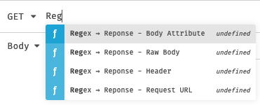
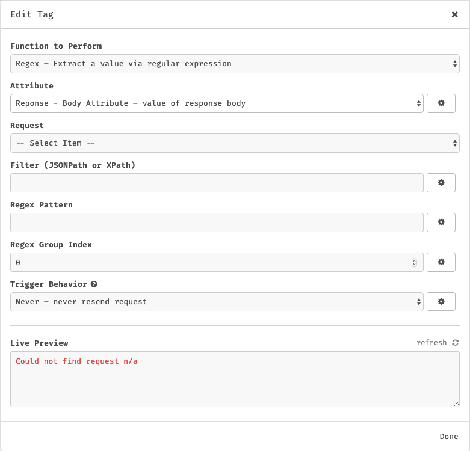

# Regex Template Insomnia Plugin

This is a plugin for [Insomnia Core](https://insomnia.rest) to add the ability to use regex to extract values when creating template tags.

## Installation

Install the `insomnia-plugin-regex-template` plugin from Preferences > Plugins.

## Usage

Once this plugin is installed, press `CRTL+Space` wherever Environment Variables can be used.

You can select any attribute from a Response (same as the official response-plugin) or an Environment Variable.

